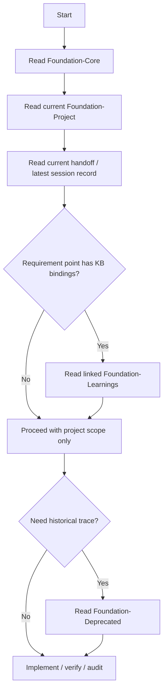
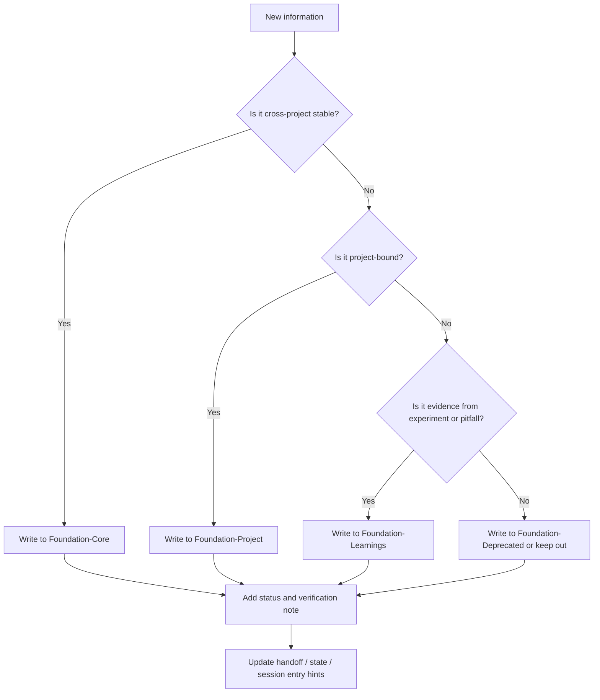

# Foundation Read/Write Flow

## Read Flow

## Write Flow

## Rules

### Read before acting

Always read from top to bottom:

1. Core
2. Project
3. Learnings
4. Deprecated only if needed

### Write with classification

Before writing any new item, decide:

- stable rule
- project rule
- learning
- deprecated

### Never mix layers

Do not place project-local findings directly into Core unless they have been verified as stable across projects.

### Keep verification attached

Every promoted item should carry:

- scope
- status
- verification target
- deprecation path if superseded
